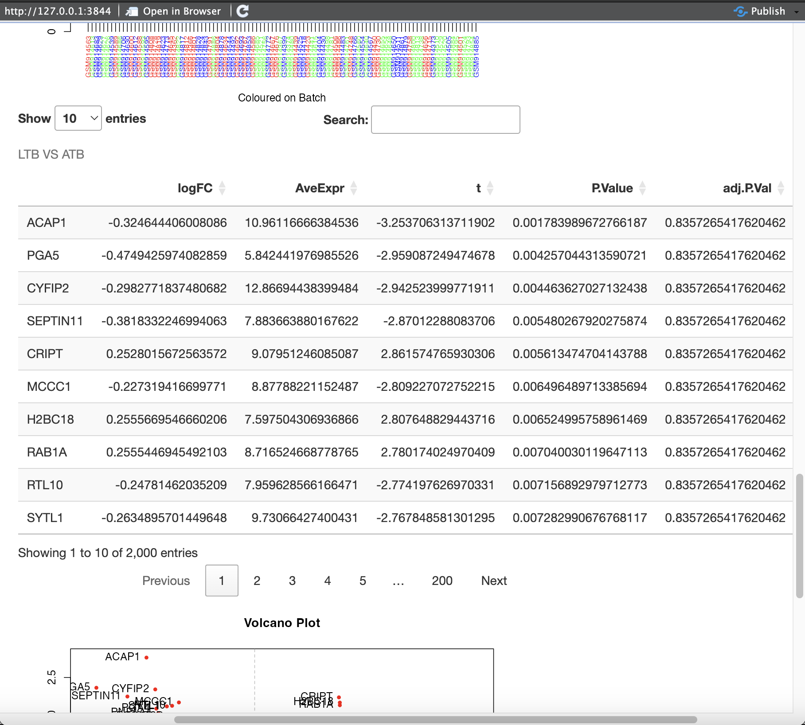

R Shiny Applications Based on the COSMOS Database
================

# Supplementary Materials

## Introduction

The below material will act as a working practice document for the use
of the Shiny Applications that work in tandem with the COSMOS database.
The applications enable users who do not have experience with coding in
R or with SQL the ability to interact with with data present in the SQL
database along with apply basic machine learning methodologies on the
data. A further explanation of the database structure can be found
[here](https://github.com/uhkniazi/SCTU_SQLDB_Supplementary/tree/master?tab=readme-ov-file),
along with a link to the published paper in SCT.

------------------------------------------------------------------------

## Prerequisites

### Downloading and Installing R and RStudio

All Shiny apps require the user to have R and Rstudio downloaded and
installed. To download the R programming language, visit [The
Comprehensive R Archive Network](https://cran.r-project.org/) and
download and install the latest distribution for your operating system.


For example, as a Windows user, you would select ‘Download R for
Windows’, then click ‘base’ as below:


Finally you will select ‘Download R-4.5 for Windows’ or whichever the
most recent distribution is which will be displayed on this page.


To run the R shiny code, it is beneficial to have a graphical user
interface. For this example we use (and recommend) RStudio which can be
downloaded from [here](https://posit.co/downloads/) for free.

To install, follow the instructions to download the installer - first
press ‘Download RStudio’


This will take you to a separate webpage, where you want to install the
Desktop application for your required operating system:


Once installed, RStudio can be opened like any other program you have
already installed on your computer.

### Setting Up the Test Database

The repository also contains a script to set up a test MySQL database
using publicly available data in order to test the analysis modules
([GSE37250](https://www.ncbi.nlm.nih.gov/geo/query/acc.cgi?acc=GSE37250)).
For purposes of example and to reduce local machine memory requirements,
the dataset size has been reduced by selecting 100 random subjects out
of the full 537.

To download MySQL Workbench, the official graphical user interface tool
for MySQL, visit [this link](https://dev.mysql.com/downloads/workbench/)
and download the latest release for your operating system.


Once downloaded, you will need to set up a new connection. This can be
done by pressing the ‘+’ as below and filling out the necessary details
(such as naming your connection). For any problems with this process,
along with a deeper walk through of the MySQL Workbench interface, it is
advisable to check the User Manual
[here](https://dev.mysql.com/doc/workbench/en/wb-sql-editor.html)


Once you have this connection set up, you can use the
‘cosmos_shiny_demo_create_db.sql’ file to populate the database. You
first will need to click the icon for ‘open’ in MySQL Workbench (this is
the second icon from the left) and navigate to the sql file you want to
open.


If you now execute the open script (shift+control/cmd+enter), you will
create the database called ‘cosmos_shiny_demo’.


If you have done everything correctly, you will now see the database in
your schema tab on the left hand side, with the appropriate tables
populated.


### Required Packages

Before we are able to run either of the included modules, we need to
ensure we have all necessary packages required by the modules installed
onto our system. You can run the below block of code to install all
required dependencies.

``` r
# List of required packages
required_packages <- c("shiny", "DT", "RMySQL", "DBI", 
                       "ggplot2", "randomForest", "MASS", 
                       "shinyWidgets", "ROCR", "tree", "carData",
                       "dendextend", "DBI", "ROCR", "methods",
                       "car", "LearnBayes")

# Install missing packages
missing_packages <- required_packages[!(required_packages %in% installed.packages()[,"Package"])]

if(length(missing_packages)) {
  install.packages(missing_packages, dependencies = TRUE)
}

# Load Bioconductor packages separately
if (!requireNamespace("BiocManager", quietly = TRUE)) {
  install.packages("BiocManager")
}

bioconductor_packages <- c("limma", "Biobase")
for (pkg in bioconductor_packages) {
  if (!pkg %in% installed.packages()[,"Package"]) {
    BiocManager::install(pkg)
  }
}

# Load all required packages
invisible(lapply(required_packages, function(pkg) suppressPackageStartupMessages(library(pkg, character.only = TRUE))))
```

Once inside RStudio, to run each app, first you need to open up the
associated R script which can be found in this repository. Once you have
the script open, the app can be run by pressing the ‘Run App’ button
found at the top right of the script.


We are now ready to look at the modules themselves and explore their
functionality.

------------------------------------------------------------------------

## SQL Query Module

The SQL query module enables user to search for pre-written, executable
queries via natural language. The module utilises an inverted index to
marry up keywords with associated queries that researchers can use to
explore the data.

When you run the app, you will be prompted to enter the Username and
Password associated with the COSMOS database. In this case, it will be
the information found on the instance you are running locally on
MySQLWorkbench. This will usually be your username on your machine, or
‘root’ along with the password you use to access your local machine.

Once open, the query tool will look like this:

  


Here we can use free-text to search for matching queries using the top
box. Lets use the example ‘subject’ which gives us the matching query
‘cosmos_showPatients’.


In cases where there may be multiple associated queries matching to your
search, you can find these using the drop down bar as below:


If we now complete the studyID (in this case, it is 10) and press
‘Execute Query’, we will now see a list of all of the participant IDs
present in our dataset:


Some queries will require extra information. One example is
‘cosmos_getAllClinicalDataForSubject’ which required an anonymised ID as
well as the StudyID to provide an output. Lets use the first ID found in
our previous query to see all the clinical data for this subject.


We can now view the specific clinical data for this participant and the
associated values.

If you would like to save any of the data tables you have generated
using the queries you can press the ‘Download’ button on the bottom
left. This will open a popup allowing you to save this file in a
specified directory as a CSV file.


------------------------------------------------------------------------

## Exploratory Analysis Tool

The exploratory analysis tool can use an expression set object selected
by the user to perform a number of exploratory data analysis methods as
well as differential expression analysis.

### Exploratory Data Analysis

The application can be used to generate low-dimension summary statistic
plots of the sample median, mean and variance from high-dimensional
omics data stored within an expression set object.

Lets first open the app, and press ‘Browse’ in the top left to find and
upload our object, stored as an RDS file. Here we will choose the file
provided in the repository.


When the upload is complete, you need to complete the study number, as
well as enter the Dataset ID in sections 2 and 3 respectively down the
left handside (in our case this is 10 and 4). Once this is done, load
the data with ‘Load Data’ and press ‘Summary Data’. This will show a
summary of the data contained within the object we have just uploaded -
here you can see there are 100 samples and 2000 features.


Now our data is loaded, we can select clinical data for our exploratory
plots using ‘6: Select Clinical Data to Use’. For this example we will
choose Disease_state and hiv_status.


If you now press ‘7: Merge Clinical Data’, you will see another table
produced, showing our chosen clinical features at the end:


We can now select a column to use for some basic exploratory plots - by
selecting ‘Disease_state’ from the dropdown and pressing ‘9: Exploratory
Analysis’, we see a number of summary graphs produced, as well as a
Principal Component Analysis (PCA) plot and hierarchical clustering for
our three disease states.


In layman’s terms, Prinicipal Component Analysis (PCA) is used to
simplify complex data by emphasising variation and showing patterns in
the dataset. For our PCA plot below, most of our data points have
clustered together, regardless of disease state. However you could argue
we have a few outliers shown on the far right of the graph.

Hierarchical clustering shows how points in our data are grouped
together based on similarity - with the y-axis showing how far apart the
clusters were when they were merged. Similarly to the PCA plot, we
cannot see any obvious intraclass similarity, although you could argue
there is similarity between some of the Latent Tuberculosis (LTB)
samples and some of the Active Tuberculosis (ATB) samples, this would
need further exploration through other methods to understand why these
samples may be similar.


### Differential Expression (DE) Analysis

This part of the application uses the Limma package to perform linear
modelling on the omics data and display a volcano plot. We can also run
Random Forest using our selected Clinical Data for Feature Importance.

If we press ‘10: Fit Linear Model’ we will be prompted to select two
levels to compare - for our example lets choose ATB and LTB.


If we now select ‘Confirm Level Selection’, a table of differential
expression will be produced, including important summary statistics such
as log fold-change, average expression, p-value and adjusted p-value.



Below this, we can see the results of the differential expression
analysis visually - presented as a volcano plot. By looking at the below
graph we can see which genes are differentially expressed in the two
levels that we chosen - those in the upper left and upper right
quadrants are statistically significant with a large fold-change,
down-regulated and up-regulated respectively in latent tuberculosis
compared to active tuberculosis.


These results can also be downloaded as a csv file, similarly to how the
results are downloaded from our query in the previous module.

Finally, we can fit a Random Forest Model, ‘12: Use Clinical Data with
Random Forest’ gives you the choice whether integrate clinical and omics
data features for feature selection. ‘13: Random Forest Model’ will then
fit the model.


This will produce a table and a corresponding plot of Variable
Importance which can be found below the volcano plot.


